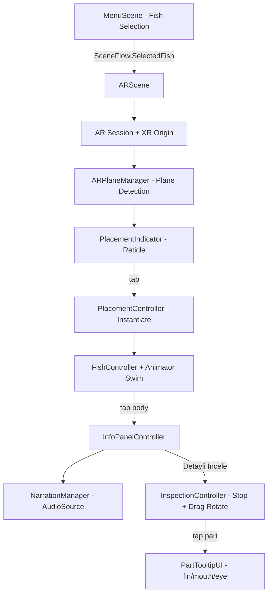

# AR Fish Museum — Artırılmış Gerçeklik Balık Müzesi

Unity 6.3 LTS + AR Foundation 6.x ile geliştirilmiş, Android (ARCore) ve iOS (ARKit) destekli
interaktif balık müzesi uygulaması. Kullanıcılar kameraları aracılığıyla gerçek zemine
3D balık modellerini yerleştirebilir, bilgi kartlarını okuyabilir, sesli anlatımı
dinleyebilir ve balığı durdurarak anatomik parçalarını inceleyebilir.

---

## Özellikler

- **Markerless AR Yerleştirme:** ARCore / ARKit plane detection ile zemin tespiti ve tap-to-place
- **Yüzme Animasyonu:** Yerleştirilen balıklar gerçekçi swim-cycle animasyonuyla yüzer
- **Bilgi Paneli:** Türkçe ad, bilimsel ad, yaşam alanı, beslenme şekli ve özet metin
- **Sesli Anlatım:** Her balık için Türkçe AudioClip (toggle play/pause)
- **Detaylı İnceleme Modu:** Animasyon dondurulur, balık kameraya yaklaşır, sürükleyerek döndürülebilir
- **Parça Bilgisi Tooltip:** Yüzgeç, ağız, göz ve kuyruk gibi parçalara dokunarak mini bilgi kartı
- **Onboarding:** İlk açılışta zemin tarama talimatı; plane bulununca otomatik kaybolur
- **Çapraz Platform:** Tek kod tabanı, hem Android hem iOS build

---

## Balık Türleri (MVP)

| Tür | Bilimsel Ad | Yaşam Alanı |
|-----|------------|-------------|
| Palyaço Balığı | *Amphiprion ocellaris* | Hint-Pasifik mercan resifleri |
| Cerrah Balığı (Mavi Tang) | *Paracanthurus hepatus* | Hint-Pasifik-Kızıldeniz mercan resifleri |

---

## Teknoloji Yığını

| Bileşen | Araç / Sürüm |
|---------|-------------|
| Oyun Motoru | Unity 6.3 LTS (6000.0.x) |
| AR Çerçevesi | AR Foundation 6.0.x |
| Android AR | ARCore XR Plugin 6.0.x |
| iOS AR | ARKit XR Plugin 6.0.x |
| Programlama | C# (.NET, Unity 6) |
| Render | Universal Render Pipeline (URP) |
| Input | Unity Input System 1.8.x |
| UI | TextMeshPro 3.0.x |
| 3D Modeller | Sketchfab CC-BY FBX (swim animasyonlu) |
| Ses | TTS ile üretilmiş Türkçe anlatım |
| Sürüm Kontrolü | Git / GitHub |

---

## Proje Yapısı

```text
YMH459-fishy-project/
├── Assets/
│   ├── Scripts/
│   │   ├── AR/          # ARSessionBootstrap, PlacementIndicator, PlacementController
│   │   ├── Fish/        # FishController, SwimAnimatorBridge, FishPartController,
│   │   │                # InspectionController, IInteractable
│   │   ├── UI/          # MainMenuController, InfoPanelController,
│   │   │                # PartTooltipUI, OnboardingOverlay
│   │   ├── Audio/       # NarrationManager
│   │   ├── Data/        # FishData (ScriptableObject), FishPartInfo
│   │   └── Utils/       # TouchInputManager, ARRaycastHelper, SceneFlow
│   │
│   ├── Scenes/
│   │   ├── MenuScene.unity
│   │   └── ARScene.unity
│   │
│   ├── Prefabs/
│   │   ├── Fish/        # Clownfish.prefab, Surgeonfish.prefab
│   │   ├── UI/          # InfoPanel.prefab, PartTooltip.prefab, FishMenuButton.prefab
│   │   └── AR/          # PlacementIndicator.prefab
│   │
│   ├── Models/Fish/     # Clownfish.fbx, Surgeonfish.fbx
│   ├── ScriptableObjects/  # Clownfish_Data.asset, Surgeonfish_Data.asset
│   ├── Audio/Narration/ # clownfish_tr.wav, surgeonfish_tr.wav
│   ├── Materials/       # ARShadowReceiver.shader + materyal
│   └── Settings/
│
├── Packages/
│   └── manifest.json    # AR Foundation, ARCore, ARKit, Input System
├── ProjectSettings/
├── Documentation/
│   ├── UnitySetupGuide.md   # Adım adım editor kurulum kılavuzu
│   ├── asset-licenses.md    # Asset lisans takip tablosu
│   └── *.pdf                # Proje dökümanları
└── README.md
```

---

## Hızlı Başlangıç

### Gereksinimler

- Unity Hub + **Unity 6.3 LTS** (Android Build Support + iOS Build Support modülleri)
- **Xcode 15+** (macOS, iOS build için)
- **Android SDK/NDK** (Unity Hub aracılığıyla kurulur)
- ARCore destekli Android cihaz (API 24+) **veya** ARKit destekli iPhone/iPad (iOS 13+)

### Kurulum

```bash
git clone https://github.com/your-org/YMH459-fishy-project.git
```

Unity Hub → **Open** → proje klasörünü seç.
Paketler otomatik yüklenir. Detaylı kurulum için
[Documentation/UnitySetupGuide.md](Documentation/UnitySetupGuide.md) belgesine bakın.

### Android Build

1. **Edit → Project Settings → Player → Android** — ayarları doğrula (API 24, IL2CPP, ARM64)
2. **File → Build Settings → Android → Switch Platform**
3. Cihazı USB ile bağla, **Build and Run**

### iOS Build

1. **Edit → Project Settings → Player → iOS** — Bundle ID ve Camera Usage Description ayarla
2. **File → Build Settings → iOS → Switch Platform → Build**
3. Oluşan Xcode projesini Xcode'da aç
4. Signing & Capabilities → Apple Developer hesabını seç
5. Cihazı bağla → **Run**

---

## Mimari



---

## Katkı

Yeni balık türü eklemek için:
1. `Assets/ScriptableObjects/` altında **Create → FishMuseum → Fish Data** ile yeni asset oluştur.
2. Alanları doldur (isim, habitat, sesli anlatım, parça listesi).
3. FBX modeli `Assets/Models/Fish/` klasörüne ekle ve prefab oluştur.
4. `MainMenuController.fishDataList` dizisine asset'i ekle.

Yeni script kodu ekleme kuralları:
- Namespace: `FishMuseum.<Alt Sistem>` (ör: `FishMuseum.Fish`)
- Dokunulabilir nesneler `IInteractable` arayüzünü uygular
- Veri `FishData` ScriptableObject'te; UI ve iş mantığı birbirinden ayrı

---

## Lisans

Kaynak kod MIT lisansı altındadır.
Asset lisansları için [Documentation/asset-licenses.md](Documentation/asset-licenses.md) belgesine bakın.
